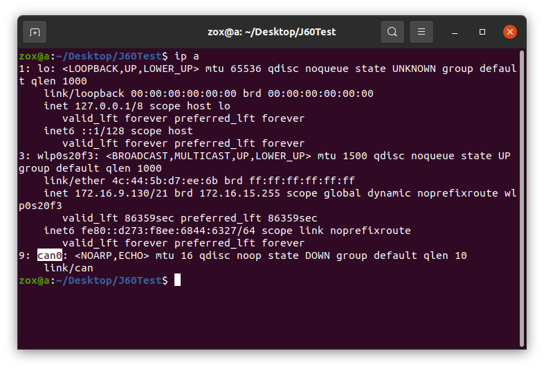
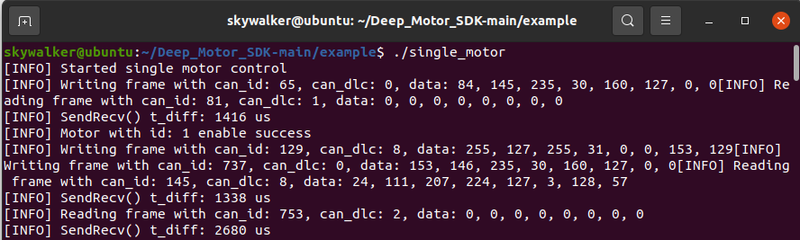
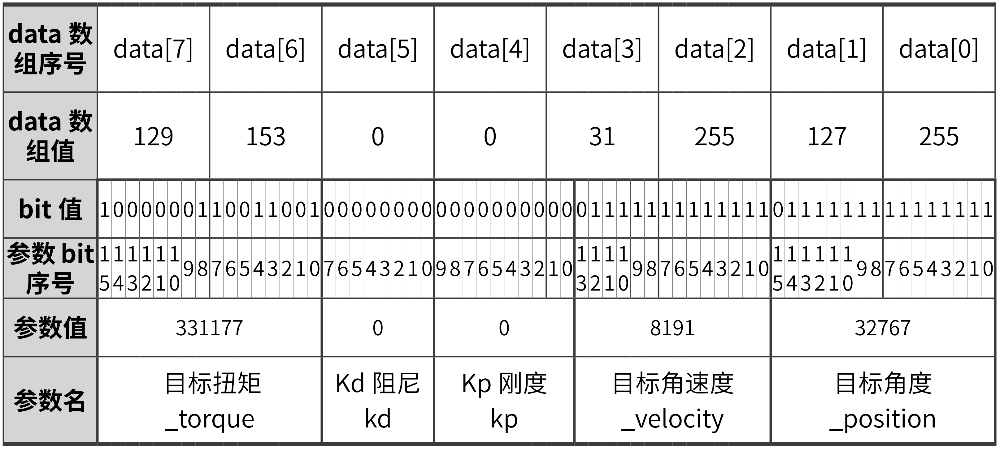
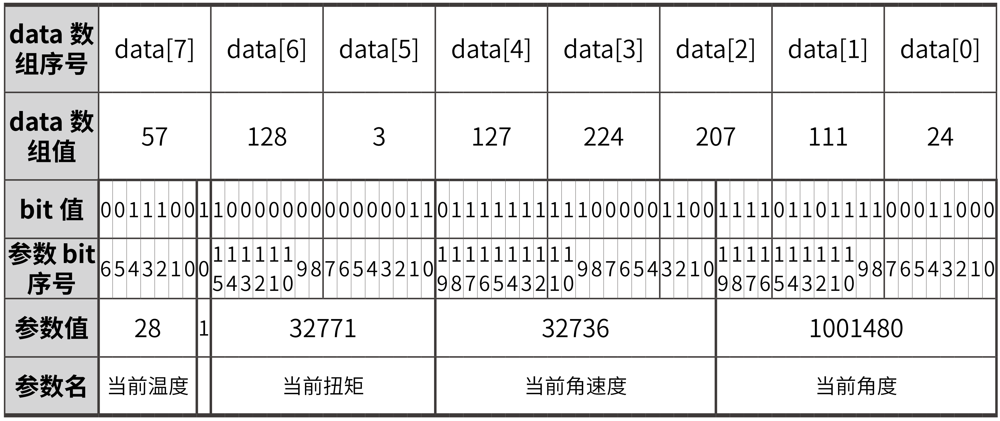
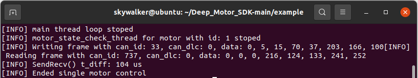

# Deep_Motor_SDK

[English](./Readme.md)

SDK提供了can通讯、关节使能、关节控制等功能，并在example文件夹中提供了单关节控制single_motor和多关节控制multi_motor的例程。  
tools文件夹中是**关节调试工具软件**，具体的使用方法可参考手册，其中Windows版本(.exe)支持Windows 10和Windows 11，Ubuntu版本(.AppImage)支持Ubuntu 20及以上版本。

## 1 环境依赖
目前仅支持在Linux系统中编译运行。

## 2 例程的编译和运行
### 2.1 检查can口通道
例程原始代码中默认使用的can接口为can0，在运行例程前请先在终端中输入`ip a`，以获取实际使用设备的can接口名称。



如果所使用的设备的can接口不是can0，请在例程代码中将can0修改为实际的通道。
```c
DrMotorCan *can = DrMotorCanCreate("can0", true);
```
同时需要将/scripts/set_up_can.sh中的can0改为实际的接口名称。
```shell
sudo ip link set can0 type can bitrate 1000000
sudo ip link set can0 up
```

### 2.2 修改关节ID
关节默认的id为1。
single_motor例程默认会与`motor_id = 1`的关节进行通信，若与实际的关节id不符，请在代码中将motor_id修改为实际的关节id。
```c
uint8_t motor_id = 1;
```
multi_motor例程默认会与motor_id为1~2的关节进行通信，若与实际的关节id不符，请在代码中进行相应的修改。

### 2.3 编译
example文件夹中已提供了可执行文件single_motor和multi_motor。若对原始的例程代码进行了修改，则需要在/Deep_Motor_SDK路径下打开一个终端中，在终端中输入`./script/compile.sh`命令重新编译例程代码。

### 2.4 运行
#### 2.4.1 设置并启动can设备
在/Deep_Motor_SDK路径下打开一个终端，在终端中输入`./script/set_up_can.sh`命令以设置can波特率并启动can设备。
#### 2.4.2 运行single_motor
在/Deep_Motor_SDK路径下打开一个终端，在终端中输入`./single_motor`命令以运行可执行程序single_motor，对应的关节将会持续转动，直至ctrl+c关闭终端。
#### 2.4.3 运行multi_motor
在/Deep_Motor_SDK路径下打开一个终端，在终端中输入`./multi_motor`命令以运行可执行程序multi_motor，对应的所有关节将会持续转动，直至ctrl+c关闭终端。

## 3 SDK的使用方法
在使用SDK编写代码的过程中，可参考example，将其include到代码文件中。
```c
#include "../sdk/deep_motor_sdk.h"
```
参考single_motor.c，可使用SDK实现以下一些功能：
### 3.1 创建和初始化can通讯接口
```c
//不显示日志
DrMotorCan *can = DrMotorCanCreate("can0", false);

//显示日志
DrMotorCan *can = DrMotorCanCreate("can0", true);
```

### 3.2 给特定id的关节发送使能命令
```c
uint8_t motor_id = 1;
SetNormalCMD(motor_cmd, motor_id, ENABLE_MOTOR);
SendRecv(can, motor_cmd, motor_data);
```
其中`SetNormalCMD()`与`SendRecv()`在`deep_motor_sdk.h`中实现。`ENABLE_MOTOR`为宏定义，请参考sdk文件夹下的`can_protocol.h`。

### 3.3 创建线程检查特定关节的工作状态
```c
void *MotorStateCheckThreadFunc(void *args){
    MotorCheckThreadParam *params = (MotorCheckThreadParam *)args;
    MotorCMD *motor_cmd = MotorCMDCreate();
    MotorDATA *motor_data = MotorDATACreate();
    SetNormalCMD(motor_cmd, params->motor_id, GET_STATUS_WORD);
    while(!break_flag){
        int ret = SendRecv(params->can, motor_cmd, motor_data);
        CheckSendRecvError(params->motor_id, ret);
        CheckMotorError(params->motor_id, motor_data->error_);
        sleep(1);
    }
    MotorCMDDestroy(motor_cmd);
    MotorDATADestroy(motor_data);
    printf("[INFO] motor_state_check_thread for motor with id: %d stoped\r\n", (uint32_t)params->motor_id);
}

pthread_t thread_id;
MotorCheckThreadParam param;
param.can = can;
param.motor_id = 1;
if(pthread_create(&thread_id, NULL, MotorStateCheckThreadFunc, (void*)&param) != 0){
    fprintf(stderr, "Failed to create thread.\n");
    return 1;
}
```

### 3.4 给特定id的关节发送控制命令
```c
SetMotionCMD(motor_cmd, motor_id, CONTROL_MOTOR,0,0,0.3,0,0);
ret = SendRecv(can, motor_cmd, motor_data);
CheckSendRecvError(motor_id, ret);
```

### 3.5 失能关节
```c
SetNormalCMD(motor_cmd, motor_id, DISABLE_MOTOR);
SendRecv(can, motor_cmd, motor_data);
```

### 3.6 回收资源
```c
DrMotorCanDestroy(can);
MotorCMDDestroy(motor_cmd);
MotorDATADestroy(motor_data);
```

## 4 SDK 例程使用与终端打印信息说明
在参考**2 例程的编译和运行**对例程进行编译，并使用关节调试工具对关节电机进行参数设置、校准和设置零位后，可以运行例程使关节电机进行运转。<br/>
此处以 SDK 文件中`example`文件夹下的`single_motor`例程为例，`multi_motor`例程可以此为参考。运行`single_motor`例程后，终端会打印以下信息：



### 4.1 使能关节
例程的第一条CAN命令的CAN ID为65 = (000 0100 0001)<sub>2</sub>，可知：Bit0-Bit3为`0001`，转换为十进制为1，即目标关节ID为1；Bit4为`0`，即为发送标志；Bit5-Bit10为`00 0010`，转化为十进制为2，即为电机使能命令（CAN命令格式与含义详见《J60关节产品手册》的**第五章 CAN通讯协议**或sdk文件夹下的`can_protocol.h`文件）。第一条CAN命令的CAN DLC为0，即CAN DATA的有效内容为0字节。<br/>
第二条CAN命令的CAN ID为81 = (000 0101 0001)<sub>2</sub>，与第一条命令相比，Bit4为1，表明该命令为接收命令。CAN DLC为1，即CAN DATA的有效内容为1字节。CAN DATA的Byte0为0，含义为成功使能。终端中有`[INFO] Motor with id: 1 enable success`的信息反馈，表明电机使能成功。

### 4.2 发送与接收控制命令
同理，下一条CAN命令的CAN ID = 129 = (000 1000 0001)<sub>2</sub>，为向关节电机1发送电机控制命令；CAN DLC为8，表明CAN DATA中Bit0-Bit63均为有效信息。该部分通过例程中的**发送控制命令**段实现：
```c
while(!break_flag)
{
    LoopControl(can, motor_cmd, motor_id, motor_data);
}
printf("[INFO] main thread loop stoped\r\n");
```
`LoopControl()`函数在example文件下的`example.h`中实现：
```c
void LoopControl(DrMotorCan *can, MotorCMD *motor_cmd, int motor_id, MotorDATA *motor_data){
    int ret = 0;
    SetMotionCMD(motor_cmd, motor_id, CONTROL_MOTOR,0,0,0.5,0,0);
    ret = SendRecv(can, motor_cmd, motor_data);
    CheckSendRecvError(motor_id, ret);
    usleep(1000);
};
```
#### 4.2.1 往MotorCMD写入控制命令
`LoopControl()`函数中的`SetMotionCMD()`函数代码位于sdk文件夹下的`deep_motor_sdk.h`，作用为向`MotorCMD`结构体写入控制命令，`SetMotionCMD()`函数代码如下：
```c
void SetMotionCMD(MotorCMD *motor_cmd, uint8_t motor_id, uint8_t cmd, float position, float velocity, float torque, float kp, float kd){
    motor_cmd->motor_id_ = motor_id;
    motor_cmd->cmd_ = cmd;
    motor_cmd->position_ = position;
    motor_cmd->velocity_ = velocity;
    motor_cmd->torque_ = torque;
    motor_cmd->kp_ = kp;
    motor_cmd->kd_ = kd;
}
```
结合`LoopControl()`函数与`SetMotionCMD()`函数代码，可知例程向`MotorCMD`写入了电机id为1，力矩为0.5控制电机命令。
#### 4.2.2 使用DrMotorCan进行数据发送
随后在`LoopControl()`函数中继续执行`SendRecv()`函数，`SendRecv()`函数能实现数据的发送和接收，并能在在出现异常情况时返回异常错误信息：
```c
int SendRecv(DrMotorCan *can, const MotorCMD *cmd, MotorDATA *data){
    struct can_frame send_frame, recv_frame;
    MakeSendFrame(cmd, &send_frame);

    struct timeval start_time;
    gettimeofday(&start_time, NULL);

    if(can->is_show_log_){
        printf("[INFO] Writing frame with can_id: %d, can_dlc: %d, data: %d, %d, %d, %d, %d, %d, %d, %d",
            send_frame.can_id, send_frame.can_dlc,
            (uint32_t)send_frame.data[0], (uint32_t)send_frame.data[1], (uint32_t)send_frame.data[2], (uint32_t)send_frame.data[3],
            (uint32_t)send_frame.data[4], (uint32_t)send_frame.data[5], (uint32_t)send_frame.data[6], (uint32_t)send_frame.data[7]
        );
    }
    
    pthread_mutex_lock(&can->rw_mutex);
    ssize_t nbytes1 = write(can->can_socket_, &send_frame, sizeof(send_frame));
    pthread_mutex_unlock(&can->rw_mutex);
    if(nbytes1 != sizeof(send_frame)){
        return kSendLengthError;
    }

    struct epoll_event events;
    int epoll_wait_result = epoll_wait(can->epoll_fd_, &events, 5, 3);
    if(epoll_wait_result == 0){
        return kRecvTimeoutError;
    }else if (epoll_wait_result == -1){
        return kRecvEpollError;
    }else{
        pthread_mutex_lock(&can->rw_mutex);
        ssize_t nbytes2 = read(can->can_socket_, &recv_frame, sizeof(recv_frame));
        pthread_mutex_unlock(&can->rw_mutex);
        if(nbytes2 != sizeof(recv_frame)){
            return kRecvLengthError;
        }

        if(can->is_show_log_){
            printf("[INFO] Reading frame with can_id: %d, can_dlc: %d, data: %d, %d, %d, %d, %d, %d, %d, %d\r\n",
                recv_frame.can_id, recv_frame.can_dlc,
                (uint32_t)recv_frame.data[0], (uint32_t)recv_frame.data[1], (uint32_t)recv_frame.data[2], (uint32_t)recv_frame.data[3],
                (uint32_t)recv_frame.data[4], (uint32_t)recv_frame.data[5], (uint32_t)recv_frame.data[6], (uint32_t)recv_frame.data[7]
            );
            struct timeval end_time;
            gettimeofday(&end_time, NULL);
            long long duration_us = (end_time.tv_sec - start_time.tv_sec) * 1000000LL +
                        (end_time.tv_usec - start_time.tv_usec);
            printf("[INFO] SendRecv() t_diff: %lld us\r\n", duration_us);
        }

        ParseRecvFrame(&recv_frame, data);
        return kNoSendRecvError;
    }
}
```
在`SendRecv()`函数中调用执行`MakeSendFrame()`函数，`MakeSendFrame()`函数位于sdk文件夹下的`deep_motor_sdk.h`中：
```c
void MakeSendFrame(const MotorCMD *cmd, struct can_frame *frame_ret){
    frame_ret->can_id = FormCanId(cmd->cmd_, cmd->motor_id_);
    switch (cmd->cmd_)
    {
    case ENABLE_MOTOR:
        frame_ret->can_dlc = SEND_DLC_ENABLE_MOTOR;
        break;

    case DISABLE_MOTOR:
        frame_ret->can_dlc = SEND_DLC_DISABLE_MOTOR;
        break;

    case SET_HOME:
        frame_ret->can_dlc = SEND_DLC_SET_HOME;
        break;

    case ERROR_RESET:
        frame_ret->can_dlc = SEND_DLC_ERROR_RESET;
        break;

    case CONTROL_MOTOR:
        frame_ret->can_dlc = SEND_DLC_CONTROL_MOTOR;
        FloatsToUints(cmd, frame_ret->data);
        break;

    case GET_STATUS_WORD:
        frame_ret->can_dlc = SEND_DLC_GET_STATUS_WORD;
        break;

    default:
        break;
    }
}
```
CAN命令的CAN ID在这一步通过`FormCanId()`函数形成（`FormCanId()`函数位于sdk文件夹下的`deep_motor_sdk.h`中），参考**4.1 使能关节**的CAN ID分解并进行逆推，此处不作赘述。通过控制命令中的`CONTROL_MOTOR` case，调用`FloatsToUints()`函数（位于sdk文件夹下的`deep_motor_sdk.h`中）对电机控制参数进行转换：
```c
void FloatsToUints(const MotorCMD *param, uint8_t *data)
{
    uint16_t _position = FloatToUint(param->position_, POSITION_MIN, POSITION_MAX, SEND_POSITION_LENGTH);
    uint16_t _velocity = FloatToUint(param->velocity_, VELOCITY_MIN, VELOCITY_MAX, SEND_VELOCITY_LENGTH);
    uint16_t _torque = FloatToUint(param->torque_, TORQUE_MIN, TORQUE_MAX, SEND_TORQUE_LENGTH);
    uint16_t _kp = FloatToUint(param->kp_, KP_MIN, KP_MAX, SEND_KP_LENGTH);
    uint16_t _kd = FloatToUint(param->kd_, KD_MIN, KD_MAX, SEND_KD_LENGTH);
    data[0] = _position;
    data[1] = _position >> 8;
    data[2] = _velocity;
    data[3] = ((_velocity >> 8) & 0x3f)| ((_kp & 0x03) << 6);
    data[4] = _kp >> 2;
    data[5] = _kd;
    data[6] = _torque;
    data[7] = _torque >> 8;
}
```
其中`FloatToUint()` 函数在`can_protocol.h`中实现，作用是将float类型的电机参数按比例映射为uint值（详见《J60关节产品手册》的**5.3 电机控制**）。<br/>
以`example.h`中的（0,0,0.5,0,0）为例，第一个0为目标角度，_position = (uint32_t)((0+40)*((float)(65535-1)/80) = 32767 = (0111 1111 1111 1111)<sub>2</sub>，data[0] = (1111 1111)<sub>2</sub>  = 255，data[1] = (0111 1111)<sub>2</sub> = 127。映射后的参数值与 data 中存储的信息见下两表：

|参数|参数名|参数值|参数二进制值|
|:---|:--:|:---:|---:|
|目标角度|_position|32767|0111 1111 1111 1111|
|目标角速度|_velocity|8191|  01 1111 1111 1111|
|Kp刚度|kp|0|  00 0000 0000|
|Kd阻尼|kd|0|0000 0000|
|目标扭矩|_torque|331177|1000 0001 1001 1001|



随后通过 SendRecv() 函数，例程会向关节电机发送 CAN 命令，并在终端中打印命令信息（参考**single_motor_0.png**中`can_id:129`的CAN命令）。
#### 4.2.3 使用DrMotorCan进行数据接收
在完成**4.2.2 使用DrMotorCan进行数据发送**后，关节电机会返回CAN命令及运动信息，以**single_motor_0.png**中CAN ID为145的CAN命令为例，参考上述处理过程的逆过程，可以得出关节电机返回的信息含义。已知该命令为电机控制的驱动器返回命令，返回的CAN DATA[0]~[7]为{24，111，207，224，127，3，128，57}，逆推过程如下（data[7]中bit0的参数名为温度标识位）：



使用`deep_motor_sdk.h`中的`UintsToFloats()`函数可以将uint值映射回float类型。例程会持续检查关节电机状态，若关节电机状态异常，将会在终端中打印异常错误。

#### 4.3 关节失能与资源回收
在终端中输入`Ctrl+C`，例程会停止发送电机控制命令并打印`[INFO] main thread loop stoped`，停止检查关节状态，并发送电机失能命令、回收资源，最终程序会显示`[INFO] Ended single motor control`。


